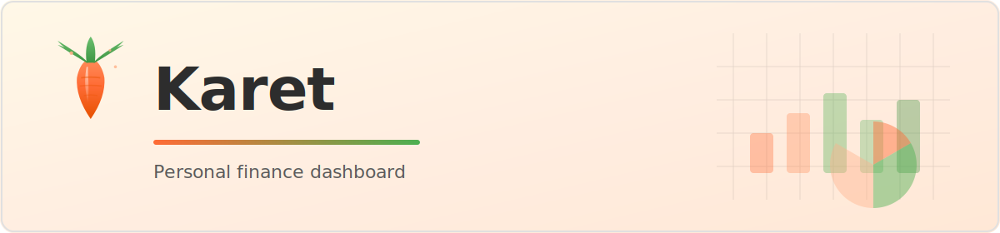

<p align="center">
  
</p>

# karet-web

A self-hostable personal finance dashboard that visualizes spending data from Parquet files in S3.

## Quick start

```bash
npm install
npm run dev
```

Open [http://localhost:3000](http://localhost:3000).

## Docker Compose

Runs RustFS (S3-compatible storage), [karet-worker](https://github.com/joeyshi12/karet-worker), and the dashboard together.

```bash
docker compose up -d
```

All configuration is contained in [`docker-compose.yaml`](docker-compose.yaml).
